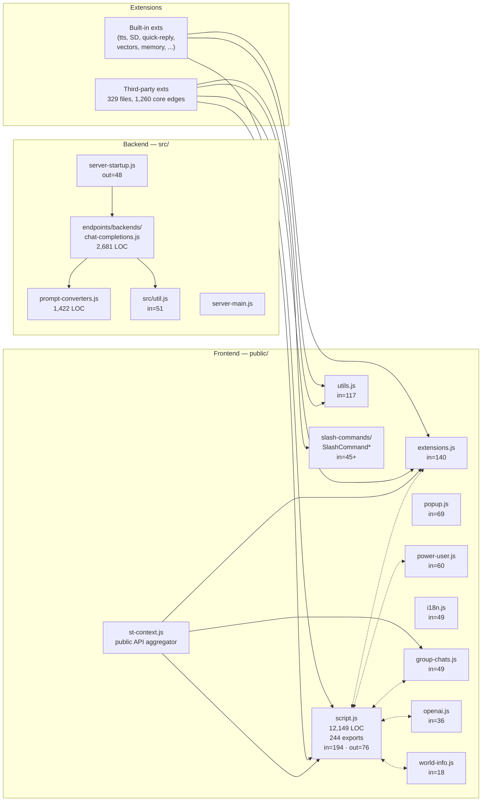
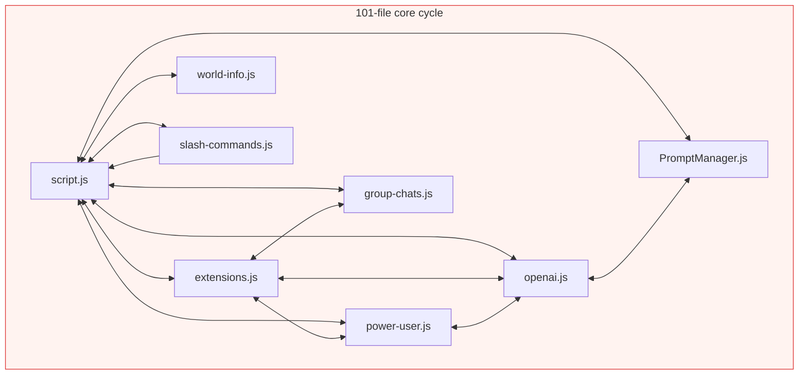
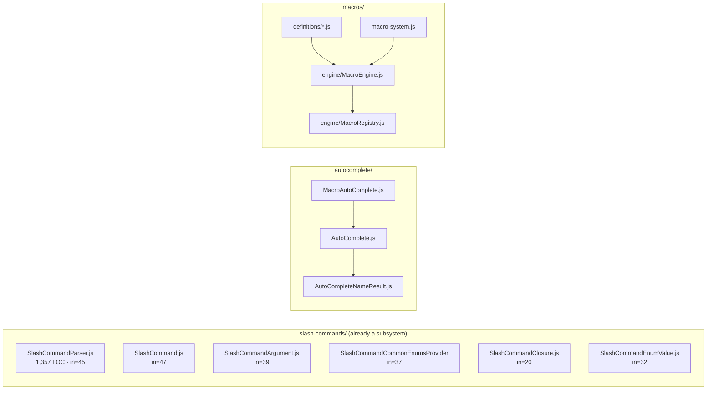
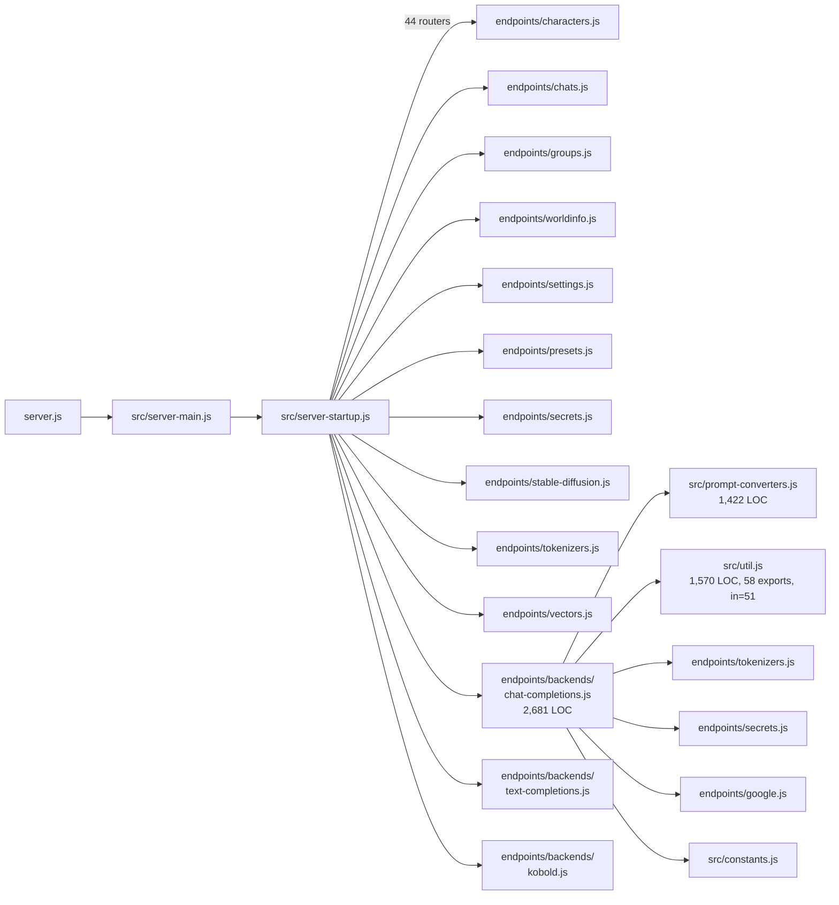
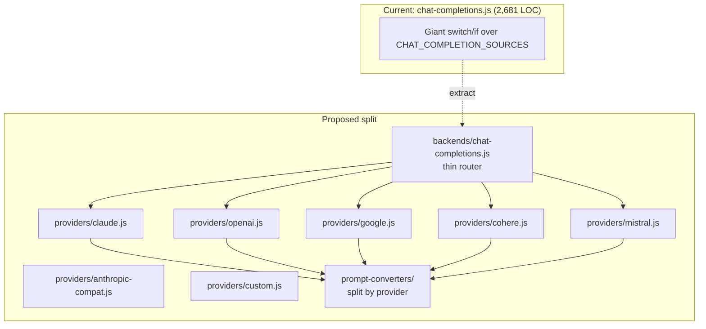

# SillyTavern — Dependency Walk & Vue 3 Modularization Plan

**Generated:** 2026-04-16
**Method:** Static ES-module import/export extraction across `public/`, `src/`, `public/scripts/extensions/**`, and the `public/scripts/extensions/third-party/**` shelf.
**Artifacts:**

- `extract_imports.py` — crawler/parser (kept in the session sandbox)
- `import_graph.json` — raw edge list (core 296 files, 1,456 edges; third-party 329 files, 1,260 edges into core)
- `analysis.txt` — analysis dump (top fan-in/out, SCCs, per-extension stats)

This document walks the graph top-down, groups modules into cohesive migration clusters, and proposes a concrete Vue 3 rollout order.

---

## 1. Executive summary

Five findings drive everything else:

1. **`public/script.js` is a god object with 244 exports, fan-in 194, fan-out 76.** Every major subsystem both reads from it and feeds back into it.
2. **There is a single 101-file strongly-connected component** spanning nearly every non-trivial `public/scripts/*.js` file. You cannot peel `script.js` apart cleanly until this cycle is broken — any naive extraction will pull the whole cluster with it.
3. **`extensions.js` is a secondary god (fan-in 140)** and, together with `st-context.js`, is the *de facto* public API for third-party extensions. 329 third-party files currently import from core; the imports hit only ~30 files, concentrated in a narrow symbol surface (see §5).
4. **A few subsystems are already well-factored:** the `slash-commands/` engine, the `autocomplete/` engine, the `macros/` engine, and the `quick-reply` extension. They are internally clean, externally still entangled.
5. **The backend is nearly cycle-free.** The endpoint routers in `src/endpoints/**` form a shallow tree rooted at `server-startup.js`. Backend modularization is a straightforward follow-up — it is not a prerequisite for the Vue 3 migration.

The cleanest migration path is therefore:

> **Freeze the extension-facing surface → migrate cross-cutting leaves → break the 101-node cycle with an event/context bus → extract chat-engine, LLM dispatch, and world-info last.**

Order and rationale in §10.

---

## 2. Dataset

| Group                           | Files | Internal edges | Notes                                                 |
|---------------------------------|------:|---------------:|-------------------------------------------------------|
| Frontend core (`public/`)       |   ~260|         ~1,350 | `script.js` + `public/scripts/**`                     |
| Backend (`src/`)                |   ~90 |           ~190 | `server-main`, `server-startup`, `endpoints/**`       |
| Built-in extensions (shipped)   |   ~55 |           ~270 | 19 extension directories under `public/scripts/extensions/` |
| Third-party extensions shelf    |    329|          1,260 | Everything under `public/scripts/extensions/third-party/` |

**Scope excluded:** `node_modules`, `public/lib/*`, `public/locales/*`, `public/vue-dist/*` (generated), runtime-only data under `data/`.

**Edge resolution:** relative specifiers only. Bare specifiers (npm packages), URL imports, and dynamic `import()` of runtime-computed strings appear in `unresolved` (501 edges). The report does not lean on them.

---

## 3. The big picture



(`<-.->` edges are symmetrical imports — the cycle.)

Shape to notice: the frontend is a fully-connected blob with `script.js` at the center; the backend is a tree with `server-startup.js` at the root.

---

## 4. Frontend detail

### 4.1 `public/script.js` — the god object

- 12,149 LOC
- **244 exports** (chat state, character state, generation functions, render helpers, UI flags, constants)
- **Fan-in 194** files (85% of core + every non-trivial extension)
- **Fan-out 76** files

Top symbols pulled from `script.js` across the codebase (core + third-party combined):

| Rank | Symbol                   | Pulls | Kind                |
|-----:|--------------------------|------:|---------------------|
|   1  | `eventSource`            |    94 | event bus singleton |
|   2  | `saveSettingsDebounced`  |    92 | write-through fn    |
|   3  | `event_types`            |    91 | event enum          |
|   4  | `getRequestHeaders`      |    64 | http helper         |
|   5  | `chat`                   |    45 | **mutable array**   |
|   6  | `characters`             |    44 | **mutable array**   |
|   7  | `this_chid`              |    40 | **mutable scalar**  |
|   8  | `chat_metadata`          |    39 | **mutable object**  |
|   9  | `substituteParams`       |    32 | pure fn             |
|  10  | `main_api`               |    22 | mutable scalar      |
|  11  | `getCurrentChatId`       |    20 | getter              |
|  12  | `extension_prompt_types` |    20 | enum                |
|  13  | `Generate`               |    10 | generation fn       |
|  14  | `reloadCurrentChat`      |    10 | side-effect fn      |

The six bolded lines are the reason the cycle exists: every consumer mutates or reacts-to shared exported `let` bindings instead of going through a store.

### 4.2 The 101-file cycle (killer problem)

A Tarjan SCC pass finds one cluster of **101 files** that all transitively depend on each other. Selected members (full list in `analysis.txt`):

```
script.js, extensions.js, openai.js, world-info.js, power-user.js,
group-chats.js, chats.js, personas.js, PromptManager.js, tags.js,
variables.js, reasoning.js, macros.js, slash-commands.js, SlashCommandParser,
instruct-mode.js, sysprompt.js, chat-templates.js, preset-manager.js,
secrets.js, textgen-settings.js, nai-settings.js, kai-settings.js, horde.js,
custom-request.js, tool-calling.js, data-maid.js, system-messages.js,
authors-note.js, bookmarks.js, bulk-edit.js, BulkEditOverlay.js,
filters.js, itemized-prompts.js, logit-bias.js, logprobs.js,
message-renderer.js, popup.js, RossAscends-mods.js, tokenizers.js,
i18n.js, templates.js, loader.js, ...  (101 total)
```

Two smaller SCCs sit alongside it:

- **`tts/` — 29 files.** `tts/index.js` plus 28 provider adapters, each importing the index (registry pattern with back-references).
- **`quick-reply/` — 13 files.** `index.js` ↔ `QuickReply` ↔ `QuickReplySet` ↔ `QuickReplySettings` ↔ UI classes.



**Implication for Vue 3:** You cannot `import { chat } from './script.js'` inside a Vue composable and expect reactivity. You also cannot safely split `script.js` file-by-file — any split that leaves `let chat = []` in the old file and references in the new one re-creates the cycle. The cycle must be broken by indirection before (or during) extraction.

### 4.3 `public/scripts/extensions.js` — the extension API

- 1,799 LOC, **23 exports**, **fan-in 140** (of which 105 are from third-party extensions)
- Exports `getContext`, `extension_settings`, `renderExtensionTemplate`/`Async`, `registerExtension*`, plus lifecycle helpers.

### 4.4 `public/scripts/st-context.js` — the `getContext()` aggregator

- 293 LOC, **fan-out 29** (imports from 29 core files)
- Exports a single function
- Purpose: assemble the object returned by `getContext()` — the officially stable surface extensions have coded against for years.

Re-reading its import block is the fastest way to understand what *must* remain callable. It reaches into `script.js`, `extensions.js`, `group-chats.js` and pulls ~70 symbols. **Treat `st-context.js` as the frozen public contract; route all new Vue stores through it rather than replacing it.**

### 4.5 `public/scripts/utils.js` — the utility grab-bag

- 2,942 LOC, **128 exports**, **fan-in 117**
- Mixed responsibilities: DOM helpers, string helpers, debounce, async `delay`, image helpers, file downloads, clipboard, UUID, escaping, timing, sortable helpers.
- The most-imported symbol is `delay` and `debounce` — pure functions with no cycle participation.
- **Good migration target.** Split into ~6 small modules, many of them pure — each becomes a Vue-ready utility or a composable.

### 4.6 Already-modular subsystems

These are internally clean; they just need thin Vue-facing adapters.



### 4.7 Per-file deep stats

| File                                         | LOC    | In  | Out | Exports | Verdict for Vue migration                     |
|----------------------------------------------|-------:|----:|----:|--------:|-----------------------------------------------|
| `public/script.js`                           | 12,149 | 194 |  76 |     244 | Split last. Must break cycle first.           |
| `public/scripts/openai.js`                   |  6,906 |  36 |  20 |      40 | Extract Message/Collection classes + streaming. |
| `public/scripts/world-info.js`               |  6,194 |  18 |  23 |      68 | Split engine vs UI.                           |
| `public/scripts/slash-commands.js`           |  5,891 |  18 |  36 |      26 | Move command handlers out; keep dispatcher.   |
| `public/scripts/power-user.js`               |  4,602 |  60 |  23 |      31 | Split into 3: UI settings, tokenizer cfg, formatting. |
| `public/scripts/utils.js`                    |  2,942 | 117 |  11 |     128 | Early win. Split into 6 small files.          |
| `public/scripts/tags.js`                     |  2,773 |  13 |  16 |      33 | Single concern. Convert to composable cleanly.|
| `public/scripts/group-chats.js`              |  2,562 |  49 |  11 |      42 | Later. Tied to chat-engine.                   |
| `public/scripts/chats.js`                    |  2,423 |  12 |  13 |      24 | After chat-engine extraction.                 |
| `public/scripts/variables.js`                |  2,381 |   5 |  15 |      19 | Independent-ish. Good mid-stage target.       |
| `public/scripts/PromptManager.js`            |  2,147 |   2 |  10 |       7 | Encapsulated. Convert to composable.          |
| `public/scripts/personas.js`                 |  2,071 |   7 |  19 |      25 | Tied to characters — bundle with character cluster. |
| `public/scripts/textgen-settings.js`         |  1,847 |  19 |  13 |      29 | Port with other provider-settings files.      |
| `public/scripts/extensions.js`               |  1,799 | 140 |  11 |      23 | Freeze surface. Put Vue store *behind* it.    |
| `public/scripts/reasoning.js`                |  1,519 |  10 |  16 |      16 | Straightforward composable.                   |
| `public/scripts/RossAscends-mods.js`         |  1,286 |  39 |  14 |       —| UI mods; many small consumers. Fold into dedicated UI composables. |
| `public/scripts/tokenizers.js`               |  1,236 |  20 |  —  |       —| Mostly pure. Early migration candidate.       |
| `public/scripts/preset-manager.js`           |  1,251 |   —|  19 |       —| Bundle with settings cluster.                 |
| `public/scripts/secrets.js`                  |  1,093 |  22 |  14 |      12 | Mostly independent. Early target.             |
| `public/scripts/popup.js`                    |    781 |  69 |   3 |       7 | **Already composable-shaped.** Convert early. |
| `public/scripts/st-context.js`               |    293 |   3 |  29 |       1 | **Do not rewrite.** Keep as compat shim.      |

---

## 5. Third-party extension API surface (preservation contract)

329 third-party files currently resolve to core. They all land on a narrow surface. If this surface stays stable, Vue 3 migration can happen behind it without breaking the ecosystem.

**Top core files imported by third-party extensions:**

| Rank | Core file                                          | Edges from TP |
|-----:|----------------------------------------------------|--------------:|
|   1  | `public/scripts/extensions.js`                     |           105 |
|   2  | `public/script.js`                                 |           104 |
|   3  | `public/scripts/utils.js`                          |            29 |
|   4  | `public/scripts/openai.js`                         |            19 |
|   5  | `public/scripts/group-chats.js`                    |            19 |
|   6  | `public/scripts/popup.js`                          |            18 |
|   7  | `public/scripts/world-info.js`                     |            13 |
|   8  | `public/scripts/slash-commands/SlashCommandParser` |            12 |
|   9  | `public/scripts/slash-commands/SlashCommand`       |            10 |
|  10  | `public/scripts/slash-commands.js`                 |            10 |
|  11  | `public/scripts/power-user.js`                     |            10 |

**Top individual symbols imported by third-party extensions** (ranked by edge count — this is your preservation contract):

| Rank | Symbol                         | From                                   | Uses |
|-----:|--------------------------------|----------------------------------------|-----:|
|   1  | `extension_settings`           | `extensions.js`                        |   70 |
|   2  | `saveSettingsDebounced`        | `script.js`                            |   52 |
|   3  | `getContext`                   | `extensions.js`                        |   50 |
|   4  | `eventSource`                  | `script.js`                            |   43 |
|   5  | `event_types`                  | `script.js`                            |   41 |
|   6  | `chat`                         | `script.js`                            |   26 |
|   7  | `chat_metadata`                | `script.js`                            |   20 |
|   8  | `this_chid`                    | `script.js`                            |   17 |
|   9  | `characters`                   | `script.js`                            |   17 |
|  10  | `selected_group`               | `group-chats.js`                       |   16 |
|  11  | `POPUP_TYPE`                   | `popup.js`                             |   14 |
|  12  | `getRequestHeaders`            | `script.js`                            |   12 |
|  13  | `SlashCommandParser`           | `slash-commands/SlashCommandParser.js` |   12 |
|  14  | `promptManager`                | `openai.js`                            |   12 |
|  15  | `extension_prompt_types`       | `script.js`                            |   11 |
|  16  | `extension_prompt_roles`       | `script.js`                            |   11 |
|  17  | `SlashCommand`                 | `slash-commands/SlashCommand.js`       |   10 |
|  18  | `groups`                       | `group-chats.js`                       |   10 |
|  19  | `saveChatDebounced`            | `script.js`                            |   10 |
|  20  | `callGenericPopup`             | `popup.js`                             |   10 |
|  21  | `renderExtensionTemplateAsync` | `extensions.js`                        |   10 |

**Design consequence:** `public/scripts/extensions.js`, the `POPUP_*` exports from `popup.js`, and the `SlashCommand*` classes need to remain importable from those exact paths with those exact names for at least one full major version. All reactive state migration happens **behind** these symbols.

---

## 6. Built-in extensions

Each extension under `public/scripts/extensions/<name>/` is a separate migration target. The per-extension import profile (top consumers of core):

| Extension            | Files | LOC    | Core imports | Sibling imports | Notes |
|----------------------|------:|-------:|-------------:|----------------:|-------|
| `tts`                |    30 | 11,822 |           54 |              60 | Registry pattern; 28 provider adapters share a SCC. Already half-migrated shape. |
| `stable-diffusion`   |     1 |  5,837 |           20 |               1 | One 5.8k-file monolith. Split by backend (SD vs ComfyUI vs ...) as a prereq. |
| `quick-reply`        |    16 |  5,746 |           41 |              42 | 13-file internal SCC; UI already separated into `src/ui/`. Clean Vue target. |
| `regex`              |     2 |  2,594 |           17 |               1 | `engine.js` + `index.js` — clean split already. |
| `expressions`        |     1 |  2,528 |           17 |               1 | Single file. Good candidate for component split (sprite picker, classifier). |
| `vectors`            |     2 |  2,328 |           17 |               2 | Two-file shape. |
| `memory`             |     1 |  1,125 |           15 |               1 | Single file. |
| `gallery`            |     2 |    914 |           14 |               0 | Clean. |
| `connection-manager` |     1 |    828 |           14 |               0 | Relatively new, already well-scoped. |
| `caption`            |     1 |    812 |           12 |               1 | Clean. |
| `translate`          |     1 |    805 |           11 |               0 | Clean. |
| `shared.js`          |     1 |    749 |            8 |               0 | Cross-extension utilities. |
| `st-director`        |     1 |    536 |            3 |               0 | Group-chat reply strategist. Small. |
| `chat-sidebar`       |     1 |    509 |            3 |               0 | Small. |
| `assets`             |     1 |    507 |            7 |               0 | Small. |
| `attachments`        |     1 |    411 |           10 |               0 | Small. |
| `openrouter-direct`  |     1 |    334 |            2 |               0 | Small. |
| `token-counter`      |     1 |      3 |            0 |               0 | **Already a Vue loader.** Reference pattern. |
| `chat-portraits`     |     1 |      3 |            0 |               0 | Already a Vue loader. |

Both `token-counter` and `chat-portraits` are three-line loader files pointing at `vue-dist/`, confirming the Phase 1 Vue bridge works. They are the template for every other extension migration.

---

## 7. Backend



**Fan-in leaders on backend:**

| File                             | In | Out | LOC   | Verdict                                   |
|----------------------------------|---:|----:|------:|-------------------------------------------|
| `src/util.js`                    | 51 |   3 | 1,570 | Split into `config.js`, `file-utils.js`, `cache.js`, `image-utils.js`. |
| `src/constants.js`               | 28 |   0 |   544 | Fine as-is.                                |
| `src/endpoints/secrets.js`       | 22 |   1 |   639 | Could split crypto vs persistence.         |
| `src/users.js`                   | 10 |   5 | 1,101 | Auth vs directory-layout split.            |
| `src/additional-headers.js`      |  8 |   3 |   251 | Fine.                                      |
| `src/endpoints/content-manager.js`|  7 |   5 | 1,046 | Split by asset category.                   |

**Observation:** no SCCs of size > 1 anywhere in the backend graph. `chat-completions.js` is a leaf (out=6, in=1 from startup). Splitting it per-provider does not require breaking cycles.

Because the backend does not block Vue 3 migration, it is sequenced later. A proposed split is in §9.

---

## 8. Proposed modularization clusters

Each cluster below is a **migration unit**: a set of files that should move together, with a proposed Vue 3 boundary and a suggested composable/component surface. Order is **not** migration order (that's §10) — clusters are ordered by coupling depth.

### Cluster A — Cross-cutting leaves (lowest coupling)

**Files:** `utils.js`, `popup.js`, `i18n.js`, `templates.js`, `loader.js`, `dynamic-styles.js`, `util/AccountStorage.js`, `util/SimpleMutex.js`, `util/AbortReason.js`, `util/showdown-patch.js`, `util/stream-fadein.js`, `showdown-exclusion.js`, `showdown-underscore.js`.

**Why a cluster:** all are leaves or near-leaves; together they're imported by ~300+ sites.

**Proposed Vue 3 shape:**

- `composables/useToast.ts` (wrapping toastr)
- `composables/usePopup.ts` — backed by `popup.js` but with a reactive wrapper; `POPUP_*` re-exported from the legacy path
- `composables/useI18n.ts` — wraps `i18n.js::t`
- `composables/useTemplate.ts`
- Utility modules: `utils/dom.ts`, `utils/string.ts`, `utils/timing.ts`, `utils/image.ts`, `utils/async.ts`

**Constraint:** symbols currently exported from `utils.js` (128 of them) must be re-exported from the original path or you break 117 import sites.

### Cluster B — Extension API surface (freeze zone)

**Files:** `extensions.js`, `st-context.js`, `extensions-slashcommands.js`.

**Why a cluster:** this is the contract with ~200+ third-party consumers.

**Proposed Vue 3 shape:**

- Keep `extensions.js` and `st-context.js` as the **only** files that third-party code imports from.
- Put reactive state behind them. `getContext()` returns a frozen snapshot (or wraps a `reactive()` object only when called from Vue).
- New composable `useExtensionApi()` for Vue-native extensions — wraps `getContext()` but with `ref()`/`computed()` over the same fields.
- **Do not remove any currently-exported symbol** without a deprecation cycle of at least one minor version. See §11.

### Cluster C — Slash commands & autocomplete

**Files:** `slash-commands.js` + all of `slash-commands/*` + `autocomplete/*` + `extensions-slashcommands.js`.

**Why a cluster:** tightly cohesive; already has proper class files.

**Boundary:** engine stays as-is; **command handlers** currently crammed into `slash-commands.js` (5,891 LOC) move into `slash-commands/handlers/<verb>.js`. Registration becomes declarative.

**Proposed Vue 3 shape:**

- `<ChatInput>` component owns autocomplete via a `useAutoComplete(input)` composable.
- `SlashCommandParser` stays plain JS (framework-independent).
- Registration API unchanged (third-party contract).

### Cluster D — Macros engine

**Files:** `macros.js`, `macros/engine/*`, `macros/definitions/*`, `autocomplete/MacroAutoComplete*`, `autocomplete/EnhancedMacroAutoCompleteOption.js`.

**Why a cluster:** self-contained. `macros/engine/` is already a proper package.

**Proposed Vue 3 shape:** no UI surface, so this stays vanilla. Exposed via `useMacros()` composable that returns `substituteParams`, `substituteParamsExtended`, `evaluateMacros`.

### Cluster E — Chat engine (highest-risk cluster)

**Files:** `script.js` chat functions, `chats.js`, `chat-backups.js`, `chat-templates.js`, `group-chats.js`, `message-renderer.js`, `bookmarks.js`, `system-messages.js`, `itemized-prompts.js`, `logprobs.js`, `reasoning.js`, `input-md-formatting.js`.

**Why a cluster:** all mutate the `chat` array and consume `event_types`.

**Proposed Vue 3 shape:**

- `stores/useChatStore.ts` — owns `chat`, `chat_metadata`, `this_chid`, `selected_group` as `ref()`s. All the existing mutable exports become reactive references; the existing path (`import { chat } from 'script.js'`) continues to return the same proxy for compatibility.
- `<MessageList>` / `<MessageItem>` / `<SwipeControls>` / `<ReasoningBlock>` / `<MessageActions>` — one component per visual concern.
- Generation-controller extracted into `useGeneration()` composable.
- `message-renderer.js` stays as a pure function module — called from `<MessageItem>`.

**Unblocker:** before this cluster can be migrated, break the 101-file SCC (§10, Phase 0).

### Cluster F — Character, persona, tags

**Files:** `script.js` character functions, `personas.js`, `tags.js`, `BulkEditOverlay.js`, `bulk-edit.js`, `filters.js`.

**Proposed Vue 3 shape:**

- `stores/useCharacterStore.ts` — owns `characters` array, selection state.
- `<CharacterList>` / `<CharacterCard>` / `<CharacterEditor>`.
- `<TagManager>` component backed by a `useTags()` composable.
- `<BulkEdit>` component.

### Cluster G — LLM provider dispatch

**Files:** `openai.js`, `textgen-settings.js`, `kai-settings.js`, `nai-settings.js`, `horde.js`, `custom-request.js`, `tool-calling.js`, `sse-stream.js`, `textgen-models.js`, `logit-bias.js`, `cfg-scale.js`, `samplerSelect.js`.

**Why a cluster:** they implement the same interface (send, stream, count-tokens, build-settings) for different backends.

**Proposed Vue 3 shape:**

- Plugin/registry pattern: `providers/<name>/index.ts` exporting a common `Provider` interface.
- `usePrompt()` composable returns the active provider.
- `promptManager` (from `PromptManager.js`) wrapped as `usePromptManager()`.
- **Backend mirror:** `src/endpoints/backends/chat-completions.js` (2,681 LOC) splits along the same seam — one file per provider. See §9.

### Cluster H — World info

**Files:** `world-info.js` only (6,194 LOC, 68 exports).

**Split:**

- `world-info/engine.js` — parsing, activation, recursion. Pure functions.
- `world-info/store.js` — `useWorldInfoStore()`.
- `<WorldInfoEditor>` component tree: `<EntryList>`, `<EntryEditor>`, `<ActivationRules>`, `<KeyMatcher>`.
- Preserve all currently-exported symbols (`world_names`, `world_info`, `createWorldInfoEntry`, `loadWorldInfo` — all consumed by third-party extensions, see §5).

### Cluster I — Settings & preferences

**Files:** `power-user.js`, `sysprompt.js`, `instruct-mode.js`, `chat-templates.js`, `preset-manager.js`, `user.js`, `server-history.js`, `secrets.js`, `setting-search.js`, `stats.js`, `backgrounds.js`, `welcome-screen.js`.

**Split:**

- `stores/useSettingsStore.ts` — power-user + UI settings.
- `stores/useTokenizerStore.ts` — tokenizer config only.
- `composables/useFormatting.ts` — chat formatting rules.
- `<SettingsDrawer>` with tabbed subcomponents (one per area).
- Preserve the `power_user` export (third-party extensions import it directly).

### Cluster J — Variables & reasoning

**Files:** `variables.js`, `reasoning.js`, `authors-note.js`.

**Proposed Vue 3 shape:** simple stores + composables; clean candidates.

### Cluster K — Built-in extensions (one at a time)

Each built-in extension is its own mini-cluster. Reference pattern: `token-counter` (already migrated). Recommended sequence:

1. `translate`, `memory`, `caption`, `connection-manager`, `assets`, `attachments` — all < 1,200 LOC, 0–1 sibling imports each.
2. `gallery`, `regex`, `chat-sidebar`, `st-director`, `openrouter-direct` — small, well-scoped.
3. `vectors`, `expressions` — mid-size, one file.
4. `quick-reply` — 16 files but already good internal shape; UI already separated.
5. `tts` — 30 files, internal 29-file SCC. Provider registry pattern translates cleanly to Vue, but needs care.
6. `stable-diffusion` — 5,837 LOC monolith. Split into backend adapters **first**, then migrate. Highest effort.

---

## 9. Backend modularization

Not blocking for Vue 3, but the same graph-driven thinking applies.



**Also:**

- `src/util.js` → `src/config.js`, `src/file-utils.js`, `src/cache.js`, `src/image-utils.js`, `src/forwarding.js`
- `src/prompt-converters.js` → `src/prompt-converters/claude.js`, `google.js`, `cohere.js`, `mistral.js`, `text-completion.js`
- `src/endpoints/characters.js` → extract `src/disk-cache.js`; card-format parsers to `src/card-formats/*.js`
- `src/endpoints/stable-diffusion.js` → per-backend submodules

---

## 10. Migration order & risk

### Phase 0 — Break the 101-file cycle (prerequisite)

The cycle exists because modules import **mutable bindings** from each other. The fix is to replace these reads with either:

1. **A read-through event/context bus** — define a small `scripts/core/state.js` that owns `chat`, `chat_metadata`, `this_chid`, `characters`, etc. behind getters/setters. Every other module imports this; nobody imports the mutable bindings from `script.js`. Then `script.js` itself can import from `core/state.js` instead of re-exporting mutable `let`s.
2. **Re-export only the getters** from `script.js`, delete the raw `let` exports.

You *don't* have to touch 244 consumers at once: keep `script.js` as a **re-export shim** that forwards to `core/state.js`. External API is unchanged; the graph becomes acyclic.

**Effort:** 1–2 weeks, one developer. **Risk:** medium — requires a full regression pass of chat/generation/character selection. **Payoff:** every subsequent phase becomes 5× easier.

### Phase 1 — Cross-cutting leaves (Cluster A)

Migrate `utils.js` → `utils/*.ts`, `popup.js` → `usePopup()`, `i18n.js` → `useI18n()`, `templates.js` → `useTemplate()`.

- Re-export every existing symbol from the legacy path.
- Add Vue composables alongside.
- Reference: current `token-counter` / `chat-portraits` loader pattern.

**Risk:** low. **Touches:** ~300 import sites, but only the new path needs changes.

### Phase 2 — Freeze the extension API (Cluster B)

Lock `extensions.js` and `st-context.js`. Add deprecation tooling: dev-mode warnings for any import path we want to retire later. Publish a versioned API doc.

**Risk:** low (no code move). **Unlocks:** everything after.

### Phase 3 — Chat engine (Cluster E)

Now that the cycle is gone and state lives in `core/state.js`, wrap it in `useChatStore()` and build `<MessageList>`. This is the biggest single win for UX and developer velocity.

**Risk:** high surface area, but cycle-free. Needs full E2E regression.

### Phase 4 — Character/persona/tags (Cluster F)

Same pattern. `useCharacterStore()` reading from `core/state.js`.

### Phase 5 — Provider dispatch (Cluster G)

Split `openai.js` along provider/component lines; mirror the backend split in §9.

### Phase 6 — Settings drawer (Cluster I)

Biggest UI rewrite. Convert each settings tab to its own component. Old `power_user` object stays exported for compatibility.

### Phase 7 — Slash commands & macros (Clusters C, D)

Mostly adapter work; internal classes stay JS.

### Phase 8 — World info (Cluster H)

Engine first, then editor UI.

### Phase 9 — Built-in extensions (Cluster K)

One per PR, in the order listed in §8.

### Phase 10 — Backend modularization (§9)

Deferrable. Can happen in parallel with any of phases 4–9.

### Phase 11 — Third-party migration guide

With the stable API surface (§5) preserved throughout, publish:

- A list of deprecated import paths.
- A `SillyTavern.getContext()` → `useSillyTavern()` mapping.
- A checklist for Vue-native third-party extensions.

---

## 11. Risk matrix

| Risk                                                  | Likelihood | Impact | Mitigation |
|-------------------------------------------------------|-----------:|-------:|------------|
| Third-party extension breakage                        |       High |   High | Freeze contract in §5; deprecation warnings before removal; keep `getContext()` stable. |
| Hidden cycle re-formation during extraction           |     Medium |   High | Add a CI check using `madge` or this script's SCC pass; fail the build if any SCC > 1 in core. |
| Reactive mutation leaking into non-Vue consumers      |     Medium | Medium | Return `toRaw()`/snapshot from `getContext()`; only Vue callers see proxies. |
| `chat`/`characters` mutation via index assignment      |       High | Medium | Wrap in a reactive `Array` proxy or switch to `ref([])` + explicit mutators. Grep for `chat.length = 0` and `characters[i] = ...`. |
| Provider split diverges from backend split            |     Medium |    Low | Use matching file names (`providers/claude.ts` ↔ `src/endpoints/backends/providers/claude.js`). |
| Settings migration loses user data                    |        Low |   High | Version the settings schema; add a migration step reading `power_user` shape. |
| TTS SCC resists refactor                              |     Medium |    Low | Keep the 29-file internal registry pattern; only migrate `tts/index.js` to Vue. |
| Slash-command handlers scattered during the split     |     Medium | Medium | Move in one PR per command group, not per file. |
| Circular import reintroduced when moving state        |       High |   High | Same CI check as above. |
| Documentation drift vs. §5 contract                   |     Medium | Medium | Machine-extract the contract from usage every release (this script can do it). |

---

## 12. Tooling recommendations

1. **Wire `madge` or a reused version of `extract_imports.py` into CI** to fail any PR that introduces an SCC of size > 1 in the core graph.
2. **Add a lint rule** blocking new `let` exports from `script.js` / `core/state.js` — force getters/setters.
3. **Run the third-party scan quarterly.** Regenerate §5 automatically and treat it as a versioned contract. The script already isolates `public/scripts/extensions/third-party/**` and will tell you when new symbols are being imported.
4. **Document the `getContext()` return type** in a `.d.ts` file; use it as the acceptance test for any future `useSillyTavern()` composable.
5. **Freeze Vue bundle size:** each migrated extension adds ~3 KB of Vue runtime code unless deduplicated. `vite.config.js` already uses library mode with externalized ST imports — keep it that way.

---

## 13. Quick-reference appendices

### 13.1 Top 20 fan-in files (migration-sensitive hubs)

```
194  public/script.js
140  public/scripts/extensions.js
117  public/scripts/utils.js
 69  public/scripts/popup.js
 60  public/scripts/power-user.js
 51  src/util.js
 49  public/scripts/i18n.js
 49  public/scripts/group-chats.js
 47  public/scripts/slash-commands/SlashCommand.js
 45  public/scripts/slash-commands/SlashCommandParser.js
 39  public/scripts/RossAscends-mods.js
 39  public/scripts/slash-commands/SlashCommandArgument.js
 37  public/scripts/slash-commands/SlashCommandCommonEnumsProvider.js
 36  public/scripts/openai.js
 32  public/scripts/slash-commands/SlashCommandEnumValue.js
 31  public/scripts/constants.js
 28  public/scripts/extensions/tts/index.js
 28  src/constants.js
 22  src/endpoints/secrets.js
 22  public/scripts/secrets.js
```

### 13.2 Top 20 fan-out files (do-too-much candidates)

```
 76  public/script.js
 48  src/server-startup.js
 39  public/scripts/extensions/tts/index.js
 36  public/scripts/slash-commands.js
 29  public/scripts/st-context.js
 25  src/server-main.js
 23  public/scripts/world-info.js
 23  public/scripts/power-user.js
 22  public/scripts/slash-commands/SlashCommandParser.js
 21  public/scripts/extensions/stable-diffusion/index.js
 20  public/scripts/openai.js
 19  public/scripts/preset-manager.js
 19  public/scripts/personas.js
 19  public/scripts/extensions/vectors/index.js
 18  public/scripts/extensions/expressions/index.js
 17  public/scripts/extensions/quick-reply/src/QuickReply.js
 16  public/scripts/reasoning.js
 16  public/scripts/tags.js
 16  public/scripts/extensions/memory/index.js
 15  public/scripts/variables.js
```

### 13.3 The 101-file core SCC

See `analysis.txt` (top-level "CIRCULAR DEPENDENCY CLUSTERS" section) for the full list. Every file in this list is currently **unsafe to extract or split in isolation**. Phase 0 breaks this cycle before any of Phases 3–8 begin.

### 13.4 Extension API preservation contract (one-liner)

Keep every currently-exported symbol from `public/scripts/extensions.js`, `public/scripts/popup.js`, `public/scripts/i18n.js`, `public/scripts/slash-commands/SlashCommand.js`, `public/scripts/slash-commands/SlashCommandParser.js`, `public/scripts/slash-commands/SlashCommandArgument.js`, `public/scripts/slash-commands/SlashCommandCommonEnumsProvider.js`, `public/scripts/slash-commands/SlashCommandEnumValue.js`, and the 70+ symbols imported from `public/script.js` (see §5) importable from those exact paths and names. **Everything else is refactorable.**

---

*End of dependency walk.*
